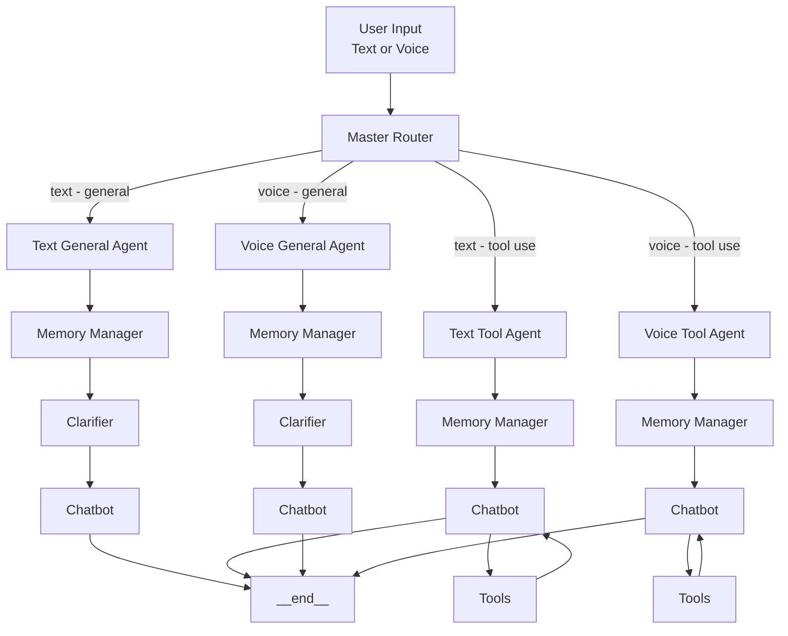

# 🩺 Zoya — Production AI Healthcare Coach

> **Multilingual AI health coach with voice + text interface, prescription & lab report analysis, and persistent memory. Deployed at production scale serving thousands of daily users.**

---

## 📊 Production Impact

| Metric | Result |
|---|---|
| Deployment | Live production system |
| Languages | English + Urdu (bilingual) |
| Modalities | Text + Voice (full duplex) |
| Memory | Persistent per-user across sessions |
| Document analysis | Prescriptions + Lab reports |
| Agent routing | 4 specialized subgraphs via master router |

---

## 🧠 What Zoya Does

Zoya is a production-grade AI healthcare coach that users interact with via **text or voice** in **English or Urdu**. She:

- Answers health, wellness, and medication questions in natural language
- **Reads and explains the user's own prescription** — medications, dosage, instructions
- **Analyzes the user's lab test reports** — what values mean, what's normal, what needs attention
- Uses **tool-augmented agents** to fetch real medical information when needed
- Remembers past conversations — knows the user's history, conditions, and preferences
- Routes each query intelligently to the right specialist agent based on intent

---

## 🏗️ Architecture Overview



---

## 🔄 How the Routing Works

Every user message hits the **Master Router** first. It classifies the intent and routes to the right subgraph:

| Route | Trigger | Agent |
|---|---|---|
| `text_general` | Text conversation, no tools needed | Memory → Clarify → Respond |
| `text_tool` | Text query requiring tool calls | Memory → Tool use → Respond |
| `voice_general` | Voice input, conversational | Memory → Clarify → Respond |
| `voice_tool` | Voice input requiring tool calls | Memory → Tool use → Respond |

Each subgraph has its own **Memory Manager** — retrieving the user's history before the chatbot responds.

---

## 🛠️ Tech Stack

| Component | Technology |
|---|---|
| Agent Framework | LangGraph (subgraph architecture) |
| LLM | GPT-4o |
| STT (Speech-to-Text) | Groq Whisper |
| TTS (Text-to-Speech) | ElevenLabs |
| Memory | Persistent per-user session memory |
| Document Analysis | GPT-4o Vision (prescriptions + lab reports) |
| Languages | English + Urdu |
| Backend | FastAPI |
| Database | PostgreSQL |

---

## 🎙️ Voice Pipeline

```
User speaks (Urdu or English)
        │
        ▼
Groq Whisper STT → Transcription
        │
        ▼
Master Router → Correct subgraph
        │
        ▼
GPT-4o processes with memory context
        │
        ▼
ElevenLabs TTS → Audio response
        │
        ▼
User hears response in natural Urdu/English
```

---

## 📄 Document Intelligence

### Prescription Analysis
- User uploads their prescription image
- GPT-4o Vision extracts: medication names, dosage, frequency, duration
- Zoya explains each medication in simple language
- Flags anything unusual or important for the user to know

### Lab Report Analysis
- User uploads their lab test report
- GPT-4o Vision reads all values: CBC, LFT, RFT, blood sugar, lipids, etc.
- Zoya explains: what each value means, normal range, whether the user's value is high/low/normal
- Provides a plain-language summary the user can actually understand

---

## 🧩 Key Engineering Decisions

**Why 4 separate subgraphs instead of one agent?**
Each modality (text/voice) and intent type (general/tool) has different latency requirements and processing needs. Separating them allows independent optimization — voice paths prioritize speed, tool paths prioritize accuracy.

**Why a Clarifier node in general agents?**
General health questions are often ambiguous. The clarifier resolves intent before sending to the chatbot, reducing hallucination and improving response relevance.

**Why Memory Manager at the subgraph level?**
Memory retrieval is expensive. Doing it per-subgraph rather than globally means each agent loads only the context it needs, keeping latency low.

---

## 📬 Want to Know More?

This is a production system handling real patient data. Deeper implementation details, live demo, and code walkthrough available upon request.

📧 adnanabdullah.dev@gmail.com  
💼 [LinkedIn](https://linkedin.com/in/adnan-abdullah-b6b49b1b6)  
🔗 [Upwork](#)

---

## 📁 Repository Structure

```
zoya-ai-health-coach/
├── architecture/         # System diagrams (shared on request)
├── results/              # Demo outputs and screenshots
├── README.md
```

---

## 📬 Connect

**Adnan Abdullah** — Agentic AI Engineer  
[LinkedIn](https://linkedin.com/in/adnan-abdullah-b6b49b1b6) • [Upwork](#) • [GitHub](https://github.com/adnanabdullah0405)
